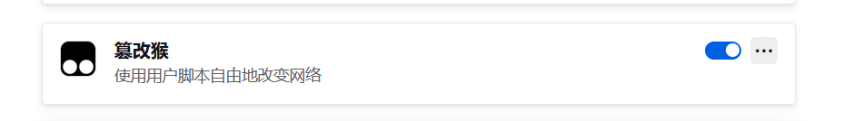
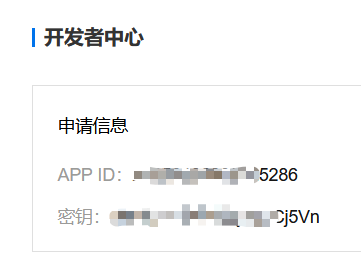
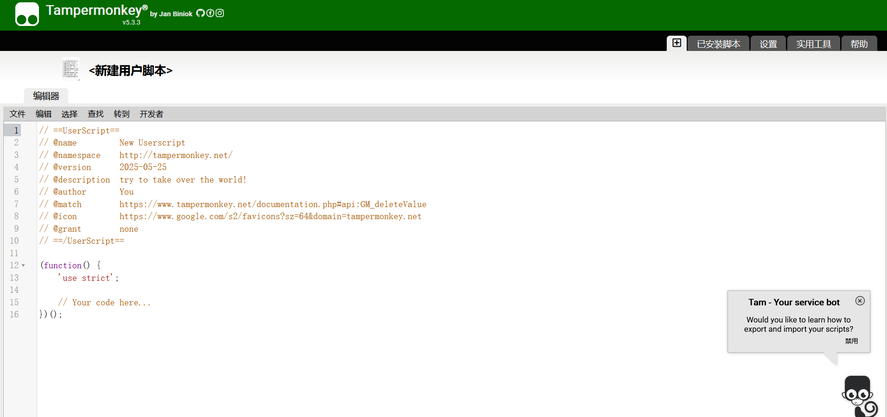
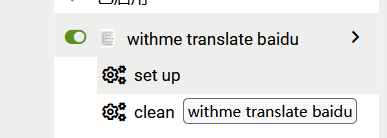

use method:
- install `tampermonkey` on your browser  

- get `appId` and `appKey` from [https://api.fanyi.baidu.com/manage/developer](https://api.fanyi.baidu.com/manage/developer)  

- create a new script on the `tampermonkey` panel  

- copy the `script.user.js` file
- settup with your appId and appKey  
